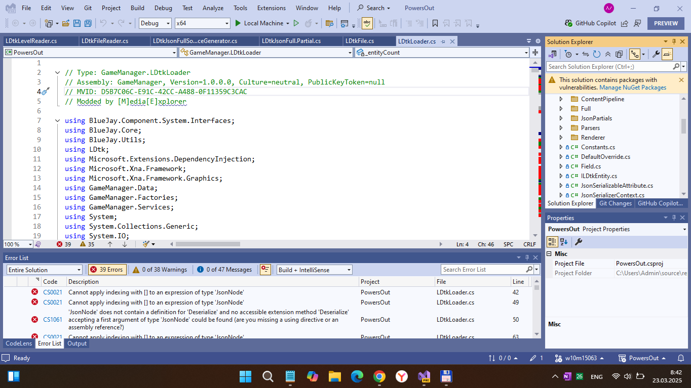

# PowersOut 1.0-prealpha - uwp branch 

"UWP-Remake" of ITCH.io PowersOut project.

## About
"Anna has just moved into a new house with her family. On one of the first nights, a thunderous boom wakes her up out of sleep. The power's gone out in the midst of the storm. Scared and alone, she is determined to get to her parent's room. With an old flashlight, she makes her way through the maze of boxes. However, with her vivid imagination, not everything is what it seems at first glance."

## Screenshots

## Tech details
- Publishing Year: 2025
- Stata / status (original): Released
- Platforms (original): Windows, macOS, Linux
- Authors:	tspayne, Radaline, Xaikune, josh.w.wade
- Janre:	Puzzle
- Labels:	2D, Atmospheric, Pixel Art, Singleplayer
- UWP app : Min Win. SDK is 16299, Main Win. SDK is 19041  

## .
As is. No support. DIY. Learn purposes only.

## Reference(s)
https://tspayne.itch.io/powers-out Original project

## ..
[m][e] March 2025
